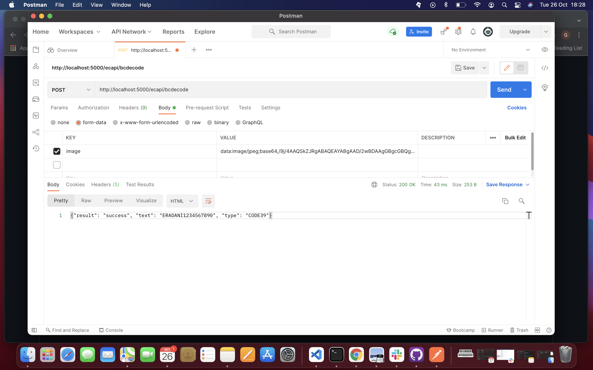

# flask-quick-start

    1. git clone https://github.com/GajenderI/flask-quick-start.git
    2. pip3 install requirements.txt
    3. python3 decode.py 
    
> To run in a separate env follow [steps](steps.md)  

    +---------+------------------------------+-----------------------+
    | Methods |             Urls             |            Actions    |
    +---------+------------------------------+-----------------------+
    | Post    | /ecapi/bcdecode              | Decode a barco        |
    +---------+------------------------------+-----------------------+
  
### Request headers  
  
>  Content-Type: application/x-www-form-urlencoded; charset=UTF-8

>  Form-data: image: BASE64ENCODED
  
### Response headers
 
> Content-Type: application/json  

              
